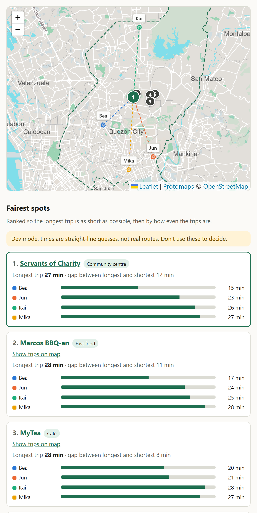
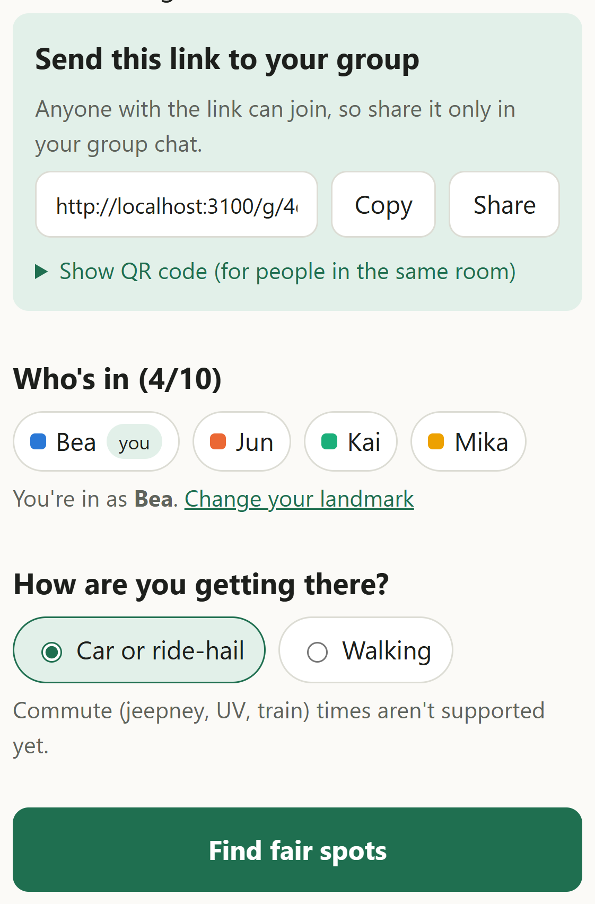
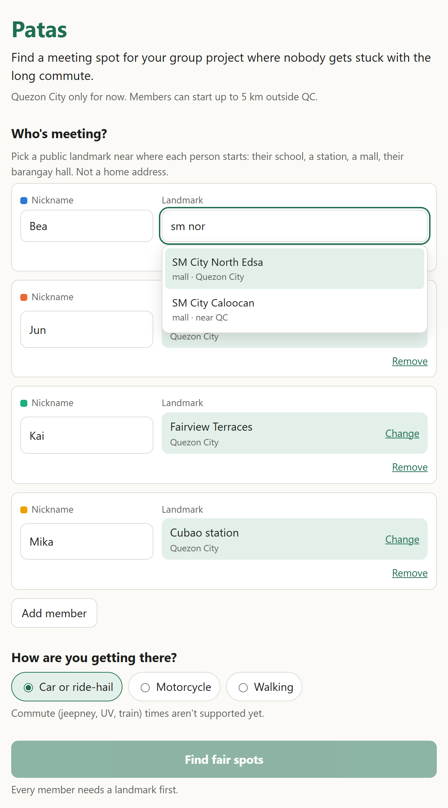
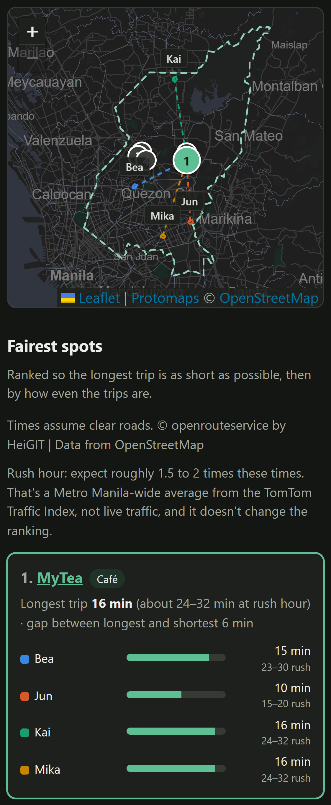

# Patas

Patas picks a meeting spot for a high school group project so that nobody gets stuck with the long commute. *Patas* is Tagalog for "even" or "fair".

It covers Quezon City only for now. Members can start up to 5 km outside the city line, since plenty of QC students live in Caloocan, Marikina or San Mateo.



## How it works

Each member picks a public landmark near where they'll start: their school, an LRT/MRT station, a mall, a church or their barangay hall. Home addresses aren't an option, because the search only knows public places.

There are two ways to do this. One person can enter everyone's landmarks on a single phone, or they can create a group link and let each member add their own landmark on their own phone:

1. Someone presses **Create a group link** on the home page and sends the link to the group chat. The page also has a share button and a QR code for people in the same room.
2. Each member opens the link, picks a nickname and a landmark, and presses **Join**. They can change their landmark later from the same phone.
3. Once at least two people have joined, anyone in the group can press **Find fair spots**.

Nobody in the group sees anyone else's landmark, only the list of who has joined and the results.





Patas then shortlists about 20 venues (libraries, malls, cafés, fast food, community centres, co-working spaces), gets each member's travel time to each one, and ranks them:

1. the shortest longest trip, so the worst-off member is as well off as possible;
2. then the smallest gap between the longest and shortest trip;
3. then the smallest total travel time.

Longest trips within 2 minutes of the best one count as a tie, because snapping each landmark to a ~200 m cell can shift a trip by about that much. Among those, the smaller gap wins, then the smaller total. The midpoint of everyone's locations is only used to start the search. It's rarely the fairest answer, because roads and traffic aren't symmetric.

On the map, each member's starting point is a ~200 m hexagon (an [H3](https://h3geo.org) cell), never an exact point. The numbered pins are the ranked venues, and the dashed lines show who travels to the selected one. They're straight lines, not routes.



The screenshots use real OpenRouteService driving times, which assume clear roads. Next to each driving time, Patas shows a rough rush-hour range of 1.5 to 2 times that figure. The range comes from the [TomTom Traffic Index](https://www.tomtom.com/traffic-index/) averages for Metro Manila (about 21 km/h overall, 19 km/h at rush hour, against the 26–37 km/h that OpenRouteService implies across QC). It's a city-wide average, not live traffic, so it sets expectations without changing the ranking. Patas is for planning a meeting ahead of time, not live navigation.

## Privacy

The people using this are minors, so the design keeps their locations out of everything that persists or leaves the server:

- The landmark list stores H3 cells, not coordinates, and the app sends only cell ids to the server.
- A group link looks like `/g/<id>#k=<key>`. The key is made in the organiser's browser and sits after the `#`, which browsers never send to a server, so it can't end up in logs. The app passes it in request bodies instead.
- Each member's cell is stored encrypted (AES-256-GCM) with a key derived from that link key, which the server never stores. A copy of the database alone reveals no locations. The cell is decrypted only in memory while ranking, is never sent back to anyone, and is deleted 48 hours after joining.
- On the single-phone planner, nicknames stay in the browser and the API sees `m1`, `m2`, and so on. With a group link, nicknames are stored so members can see who has joined, which is why the form asks for a nickname rather than a name.
- Landmark search, candidate venues and map tiles are all served from local OpenStreetMap snapshots, so no third party sees what a member typed or which part of the city they're looking at.
- The only outside call is the travel-time request to the routing provider, which gets cell centres, not landmarks.
- Nothing location-related is logged, and the only location data stored is those encrypted, expiring cells.

## Run it locally

You need Node 22.6 or newer.

```bash
npm install
```

The map needs a Metro Manila basemap (about 39 MB). Install the [`pmtiles` CLI](https://github.com/protomaps/go-pmtiles/releases), then:

```bash
npm run fetch:tiles
```

Without a routing key, run in estimate mode, which fakes travel times from straight-line distance. Put this in `.env.local`:

```
ROUTING_PROVIDER=estimate
```

For real driving and walking times, use a free OpenRouteService key from a [HeiGIT account](https://account.heigit.org) instead:

```
ORS_API_KEY=your-key
```

Then:

```bash
npm run dev
```

Open http://localhost:3000.

Group links need a database. Locally they work with no setup: without `DATABASE_URL`, the dev server keeps a [PGlite](https://pglite.dev) database (Postgres compiled to WebAssembly) in `.data/`. For a real deployment, point `DATABASE_URL` at Postgres (Neon's pooled connection string; see [docs/deploy.md](docs/deploy.md)) and apply the migrations:

```bash
npm run db:migrate
```

## Deploying

Set these on the host, since `.env.local` isn't deployed:

- `ORS_API_KEY` for travel times;
- `DATABASE_URL` for group links, then run `npm run db:migrate` against it once. Without it, the single-phone planner still works and group links answer "not set up".

The map file (`public/tiles/metro-manila.pmtiles`, about 39 MB) is gitignored, so a deploy from git won't have it. Run `npm run fetch:tiles` as part of the build, or upload the file to the host.

With a database configured, searches, group creation and joins are rate-limited per client. Only a hash of the client's IP address is stored. Expired groups and landmarks are deleted as the app runs; `npm run db:purge` does the same on demand.

## Useful commands

| Command | What it does |
|---|---|
| `npm test` | Unit tests (scoring, scope, H3, landmark search, OSM parsing, group links against PGlite) |
| `npm run db:migrate` | Apply new files in `supabase/migrations` to `DATABASE_URL` |
| `npm run db:purge` | Delete expired encrypted cells and groups (the app also does this as it runs) |
| `npm run smoke` | Live check of candidate lookup and routing with three public landmarks |
| `npm run fetch:venues` | Rebuild `data/qc-venues.json` from OpenStreetMap |
| `npm run fetch:landmarks` | Rebuild `data/qc-landmarks.json` |
| `npm run fetch:boundary` | Regenerate the Quezon City boundary polygon |
| `npm run fetch:tiles` | Cut the Metro Manila basemap into `public/tiles/` |
| `npm run screenshots` | Regenerate the images in this README against a production build (see the script header) |

## Status

This is an MVP. Still to come:

- "we met here", so the next search favours whoever travelled most last time;
- jeepney, UV and train times, and fares;
- a curated list of venues that actually let students stay for hours;
- an option to hide each member's travel times from the rest of the group.

The working notes and ordered next steps are in [CLAUDE.md](CLAUDE.md).

## Data

Venue, landmark, boundary and map data © [OpenStreetMap contributors](https://www.openstreetmap.org/copyright), available under the ODbL. Basemap tiles are built by [Protomaps](https://protomaps.com).
